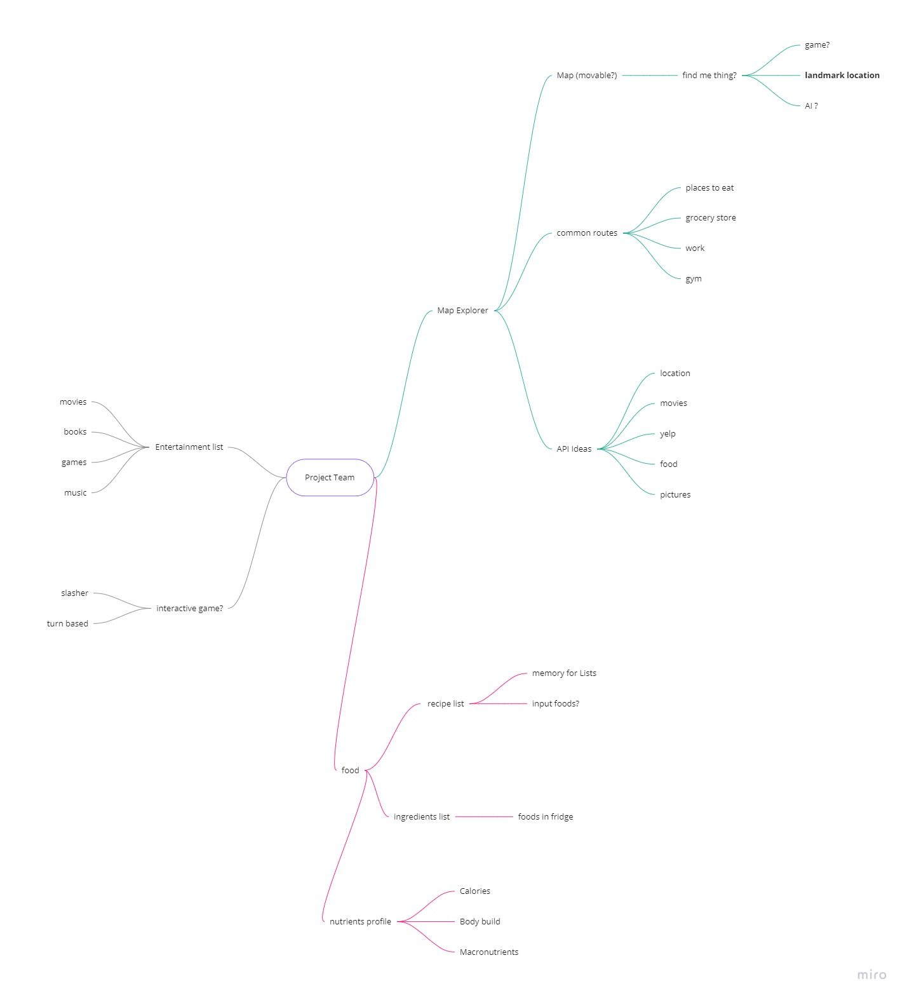

# Pitch 1: City Explorer PLUS!
- Add extra styling and interactivity to city based data
- Saves routes that are used often (from places to eat, grocery stores, etc.)

# Pitch 2: Food Idea
- Recipe List > Memorizes recipes, ingredients, directions

# Pitch 3: Enterntainment List
- Display movies, books, games, music that user may be interested in

# Final Verdict: City Explorer PLUS

## Main Features:
- Google Maps API
- Google Images API
- Log In (Auth0)
- Cache/Local Storage Implementation

## Pitched Features:
- Restaurant APIs
- Saves pins that the user drops
- Local Storage can save user queues (log-in info, etc.)

## What problem or pain point does it solve? a. Keep it high level without going into too much detail. (3-4 sentences is enough)
- Can save a variety of the user's favorite locations and info about such places
- Can recognize pinned locations as the user's

## What is the minimum required for you to present on your demo day?
- Map Search and Desplay
- Save Favorite Locations and User data
- Routes for About page and Profile Page
- 2 additional APIs referenced and displayed
- User authentication
- Accordion displaying additional search results
- Favorite locations list within profile page

## Miro Link:
https://miro.com/app/board/uXjVPa3MprQ=/

# API URLs:
