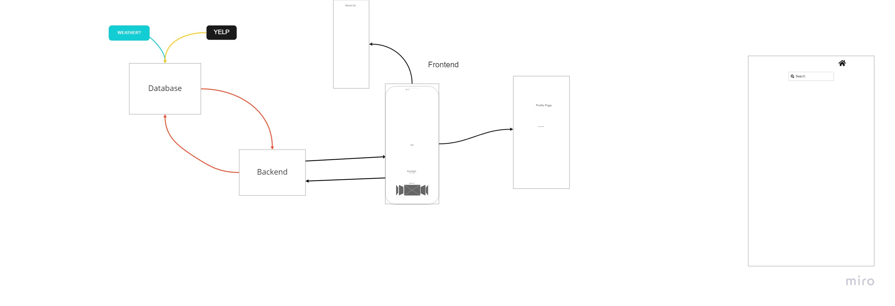

# Software Requirements
## Vision
- What is the vision of this product: The vision of this project involves expanding on user imported data and requests for locations to it's fullest potential
- What pain point does this project solve: This project attends to the interactivity and encouragement of citizens to explore their surrounding environment. With this project, this will allow the user to engage in their environment curiosity and do so with comfortability and ease.
- Why should we care about your product: The interface of this project offers the potential for an individual to virtually navigate any city, landmark, or destination that piques their interest.

# Scope (In/Out)
## IN - What will your product do

## Describe the individual features that your product will do: 
Features that this product include:
- Saves user inputted locations and data that's included within it
- Location information can be retrieved by the user

## OUT - What will your product not do:
- Product won't be able to do interact directly with locations (e.g make reservations)*
- 

# Minimum Viable Product
- What will your MVP functionality be: 
    - Map Display
    - Saves requested locations within database
    - Saves login & profile
    - Implement Auth 0 
    - About Me (Name, GitHub, LinkedIn, Description, Profile Picture)
    - Movable Map
    - Categorizes the location by type
    - 2 additional API usages (Yelp, ?)
- What are your stretch goals:
    - Implementing map directions
    - Street view
    - When location is picked, pictures related to location are reflected into request location
    - Weather, Activities, Recommendations
    - Filters for types of location data
    - Implement another API and it's potential features
- What stretch goals are you going to aim for:
    - Map directions
    - Recommendations based on location
    - Location images
    - New API & additional related features

# Functional Requirements
- List the functionality of your product:
    - Database to store information
    - Cache implementation
    - Authorization & Authentication

# Data Flow
- Describe the flow of data in your application:
        

# Non-Functional Requirements
- Non-functional requirements are requirements that are not directly related to the functionality of the application but still important to the app:
    - Dependencies that need to be imported